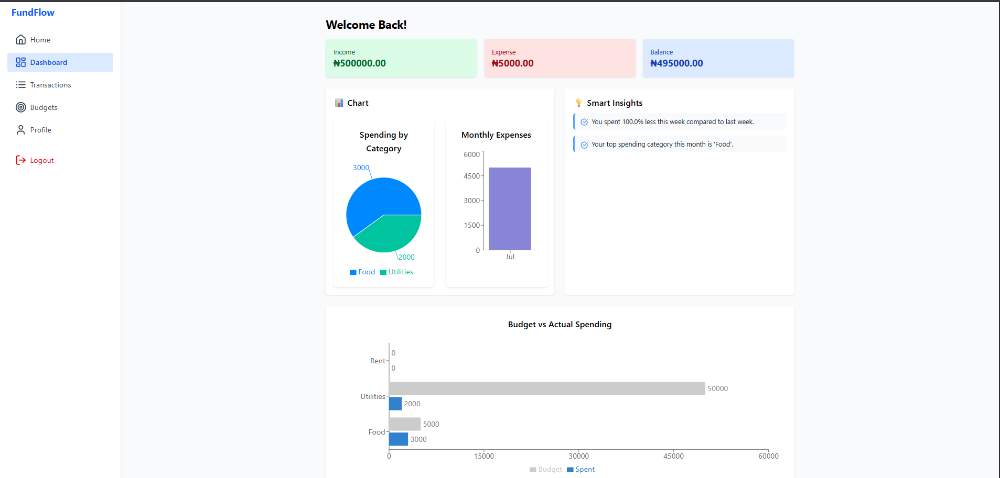
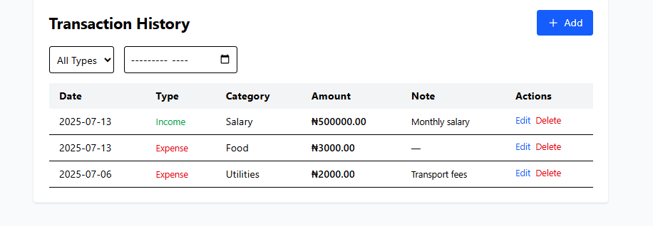
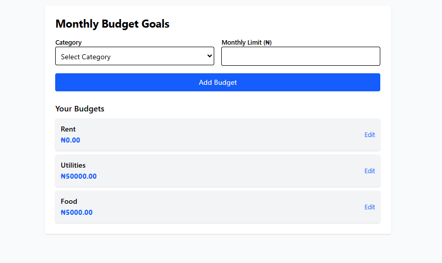

# 💰 FundFlow — Budget & Expense Tracker with AI Insights

**FundFlow** is a modern web app that helps users track income and expenses, manage budget goals, and get smart AI-powered spending insights. Built with **React**, **Django REST API**, and **JWT Authentication**, it features a clean dashboard, interactive charts, and responsive design.

## 📸 Screenshots

| Dashboard | Transactions | Budget Goals |
|-----------|------------------|---------------|
|  |  |  |

---

## 🚀 Live Demo

[Live Demo Coming Soon](#) <!-- Replace with your deployed URL -->

---

## 🛠 Tech Stack

- **Frontend:** React, Tailwind CSS, React Router, Axios, Toastify, Recharts
- **Backend:** Django, Django REST Framework, Simple JWT
- **Database:** SQLite (dev)
- **Authentication:** JWT (access + refresh)
- **AI Module:** Rule-based insights

---

## ✨ Features

- 🔐 JWT-based user authentication (register/login)
- 💸 Add income and expenses by category
- 📊 Monthly and category-wise charts (Recharts)
- 🎯 Set budget goals per category
- 🤖 AI-generated insights like overspending warnings
- 🧾 View and edit transaction history
- 📝 User profile update
- 📱 Fully responsive UI

---

## 📦 Installation

### 1. Clone the repository

```bash
git clone https://github.com/yourusername/fundflow.git
cd fundflow
````

### 2. Backend Setup (Django)

```bash
cd backend
python -m venv env
source env/bin/activate  # Windows: env\Scripts\activate
pip install -r requirements.txt
python manage.py migrate
python manage.py runserver
```

### 3. Frontend Setup (React)

```bash
cd ../frontend
npm install
npm run dev
```

---

## 📁 Folder Structure

```
fundflow/
├── backend/              # Django backend
│   ├── tracker/          # Main Django app
│   └── ...
├── frontend/             # React frontend
│   ├── src/
│   └── ...
├── screenshots/          # Screenshots for README
└── README.md
```

---

## 🧠 AI Insight Examples

Custom rule-based insights:

* "You spent 30% more on food this month."
* "Your total expenses exceeded your monthly income."
* "Top 3 spending categories: Food, Rent, Shopping."

Coming soon: spaCy integration for NLP-based insights.

---

## 🚧 Future Improvements

* [ ] Export reports to PDF
* [ ] Multi-currency support
* [ ] PWA for offline access
* [ ] Role-based access (admin/freelancer)
* [ ] Dark mode

---

## 🙌 Acknowledgements

* [Tailwind CSS](https://tailwindcss.com/)
* [Recharts](https://recharts.org/)
* [React Toastify](https://fkhadra.github.io/react-toastify/)
* [Simple JWT](https://django-rest-framework-simplejwt.readthedocs.io/)

---

## 👤 Author

**Ibraheem Olabintan**
GitHub: [@highfrezh](https://github.com/highfrezh)

---


